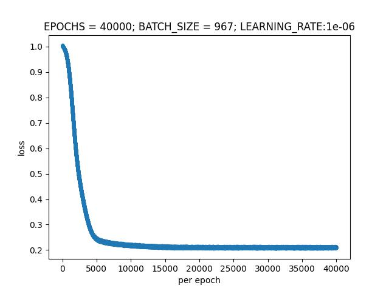

# AudioAnomalyDetection2022

## The target

    There are leaks in water pipelines. Traditionally, experienced people are required to listen for leaks manually, but this method is time-consuming, laborious and costly, and has certain errors. Now the data of leak detector is provided. We need to use relevant technologies to train the model, which can classify the given sound data and identify abnormal sounds, so as to achieve the effect of leak detection.

## Project research

        This task is a binary classification problem and also an audio-based anomaly detection problem, which is to identify abnormal data from a set of audio signal data. Anomaly detection has many applications in industrial troubleshooting. In the application scenario of this task, abnormal data is the sound data collected from the water pipe segment with leakage. At present, the commonly used acoustic signal extraction methods include Line Spectrum, Log MEL, MEL frequency cepstrum coefficient (MFCCs), harmonic component (HPSS-H), impact component (HPSS-P), etc. However, in reality, the industrial failure rate of various equipment is low, there are many kinds of faults and the operating environment is relatively complex, so it is difficult to collect the real abnormal sound signals of multiple types and working conditions. Unsupervised anomaly detection training process can be completed only with normal samples, so unsupervised anomaly detection method is particularly important in industrial acoustic detection.

## Solution

Figure: Flowchart of the scheme

1. Firstly, normal audio data and abnormal audio data can be used for training feature extractor, and features in the middle of the network can be extracted for subsequent training. Densenet-121, MobileNetV3and Resnet-50 are available. (If there is less abnormal audio data, the normal data set can be used to generate abnormal data for training in a semi-supervised manner.)

2. After the feature extractor is obtained, features are available. After AE autoencoder is used for training, the input data of training are normal data, and TRAINING AE can reconstruct normal data with small error.

3. The characteristics of test data are input into trained AE. If the error is within the threshold, the data is normal; otherwise, it is abnormal. (Because in unsupervised anomaly detection, AE is first trained with normal data so that the encoding and decoding network can learn the expression mode of normal data, so that normal data can be reconstructed with a small error in the testing process, while abnormal data can be reconstructed with a large error. Therefore, the reconstruction error can be used as the detection standard for abnormal detection.)
   
   ### Supplement:
   
   A control group can be added and the results of AE training using MFCCs and other traditional audio features can be compared. At the same time, **VAE** and other automatic encoders can be adopted to improve the results.

## Record

2022/3/8  create the project

2022/6/29  Stage result:

<

Figure:loss per epoch

Figure: get threshold

Figure: result

The current accuracy rate is 98.58757062%, the detection rate of leaked data is 100%, but there is a small amount of normal data error detection. For detailed results, you can view the CSV file in the result folder.
