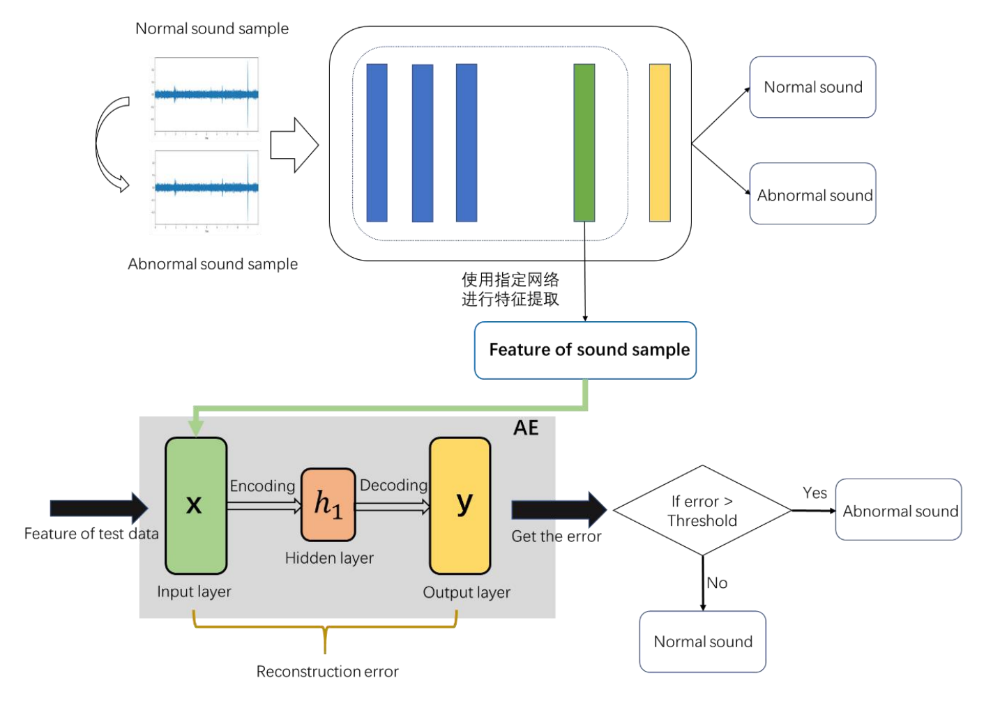

# AudioAnomalyDetection2022
## The target
Traditionally, it takes an experienced person to listen for leaks in water pipes, but this method is time-consuming, laborious and costly
People also have a certain amount of error. Now with the data from the leak detector, we need to train the model using the relevant technology to be able to
The given sound data is classified to distinguish abnormal sound, so as to achieve the effect of leak detection.

## Project research
The task is a dichotomous problem and also an audio-based anomaly detection problem from a collection of audio signal data sets
To identify abnormal data, anomaly detection has many applications in industrial troubleshooting. In the application scenario of this task
In, abnormal data is the sound data collected from the leaking pipe section.
At present, the commonly used acoustic signal extraction methods include Line Spectrum, Log MEL, MEL frequency cepstrum coefficient (MFCCs), harmonic component (HPSS-H), impact component (HPSS-P), etc.
The training of anomaly detection model in supervised way requires a large amount of marked data, but in reality
The industrial failure rate of all kinds of equipment is low, there are many kinds of failures and the operating environment is relatively complex, so it is difficult to collect multi-type and multi-working conditions
Real abnormal sound signal. Unsupervised anomaly detection training process can be completed only with normal samples, so there is no supervised anomaly detection
The method is very important in industrial acoustic detection.

## Solution 

Figure: Flowchart of the scheme

1. First of all, normal and abnormal audio data can be used to train the feature extractor and extract the middle of the network
Is used for subsequent training. Densenet-121, MobileNetV2 and Resnet-50 are available for this network
And so on. (If abnormal audio data is low, abnormal data can be generated from normal data sets in a semi-supervised manner
Train.)
2. After getting the feature extractor, there is a feature, using AE autoencoder for training, training input number
All data are normal data, and trained AE can reconstruct normal data with small error.
3. Input the characteristics of the test data into the trained AE. If the error is within the threshold, the data is normal
It's not normal. (Because in unsupervised anomaly detection, AE is first trained with normal data to encode solutions
Code network to learn the expression of normal data, testing process so that the normal data can be reconstructed with a small error, and
Reconstruction of abnormal data will produce large errors. Therefore, the reconstruction error can be used as the detection standard for abnormal detection.)
### Supplement:
A control group can be added and the results of AE training using MFCCs and other traditional audio features can be compared. Or do it without AE
Classification, using other methods for horizontal comparison.

## Record
2022/3/8  create the project

